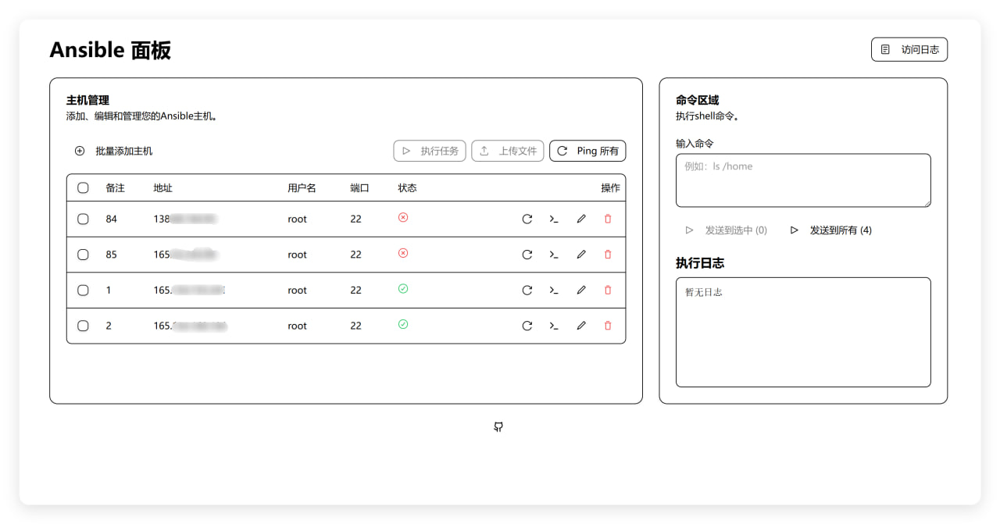
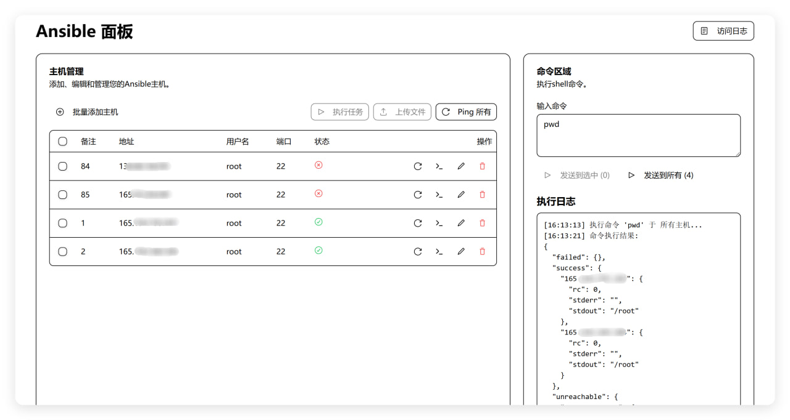
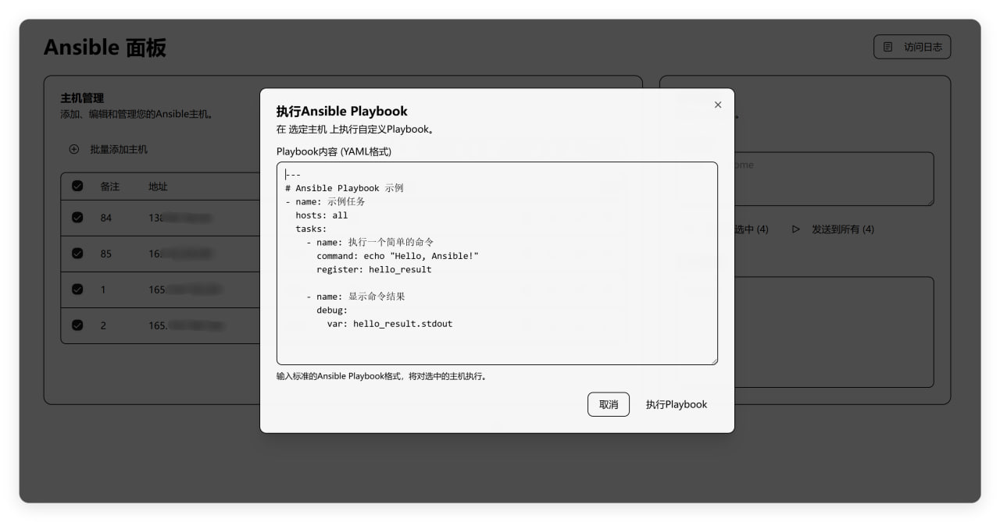
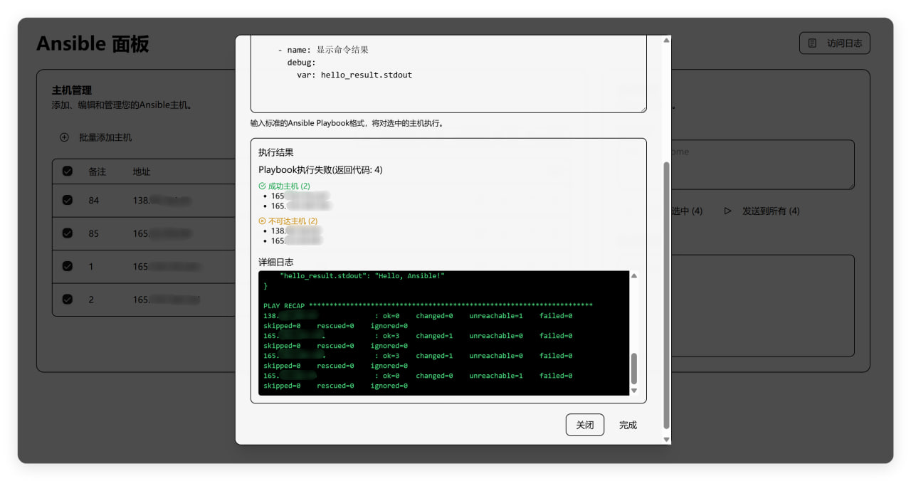
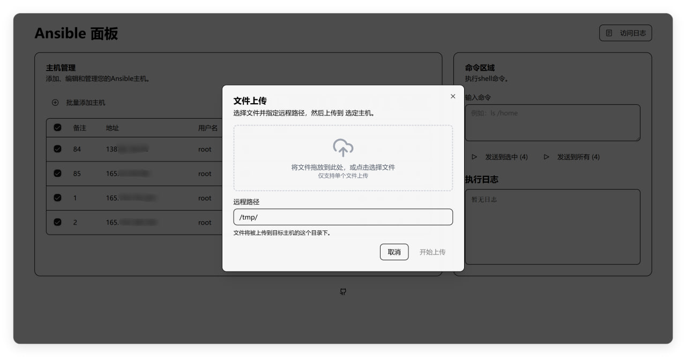
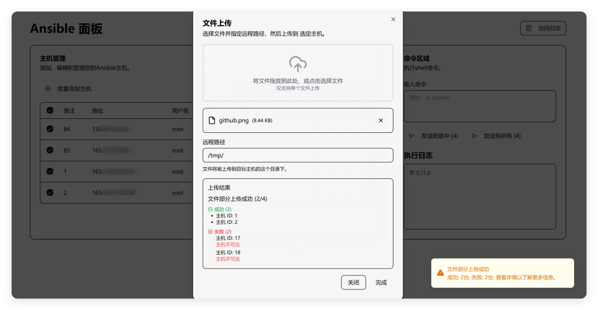
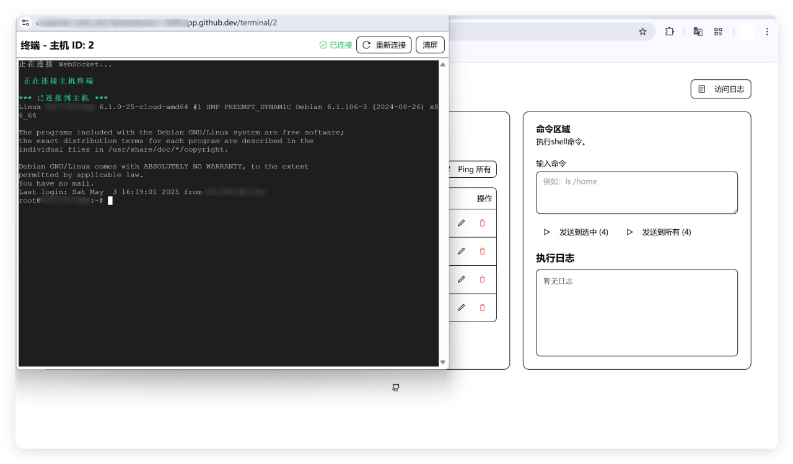
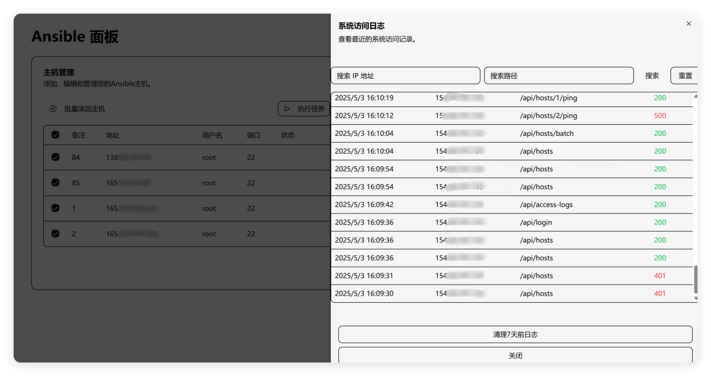

# Ansible Web管理面板

基于Flask和React的Ansible Web管理界面，提供主机管理、命令执行、文件传输和Web终端等功能。

## 功能特性

- 主机管理：批量添加主机
- 主机密码加密存储，提高安全性
- 命令执行：向选中主机发送命令并查看结果
- 文件上传：上传文件到选中主机
- 自定义Playbook执行：编写和执行Ansible Playbook任务
- Web终端：通过浏览器直接连接到远程主机
- 访问日志：记录和查看系统访问情况

## 安全特性

- **凭证派生加密**：系统使用管理员的用户名和密码派生加密密钥，提供额外的安全层
- **会话隔离**：加密密钥仅在用户登录会话中存在，未登录状态下无法访问加密数据
- **零本地存储**：加密密钥完全不会存储在文件系统中，仅在内存中派生和使用
- **无默认凭证**：系统强制要求设置管理员环境变量，不使用任何默认值或备用方案

## Docker快速部署
```
docker run -d \
  --name ansible \
  -p 5000:5000 \
  -e ANSIBLE_HOST_KEY_CHECKING=False \
  -e ADMIN_USERNAME=admin123 \
  -e ADMIN_PASSWORD=admin123 \
  -v ./ansible:/app/db \
  ghcr.io/sky22333/ansible
```
建议反代并开启HTTPS加强安全性。务必设置一个强密码

## 注意事项

- **环境变量要求**：请修改`ADMIN_USERNAME`和`ADMIN_PASSWORD`用户名密码的环境变量
- **密钥生成**：系统完全依赖管理员凭证派生加密密钥，无任何本地密钥文件
- **密码更改**：如果修改了管理员密码，之前加密的数据将无法解密，请在修改密码前备份重要数据
- **会话限制**：加密密钥仅在登录会话中有效，如果服务重启，需要重新登录才能访问加密数据


## 预览



---



---



---



---



---



---



---



